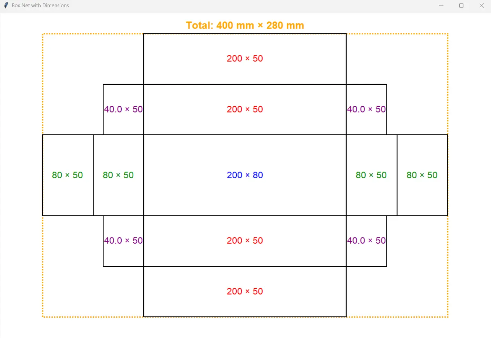
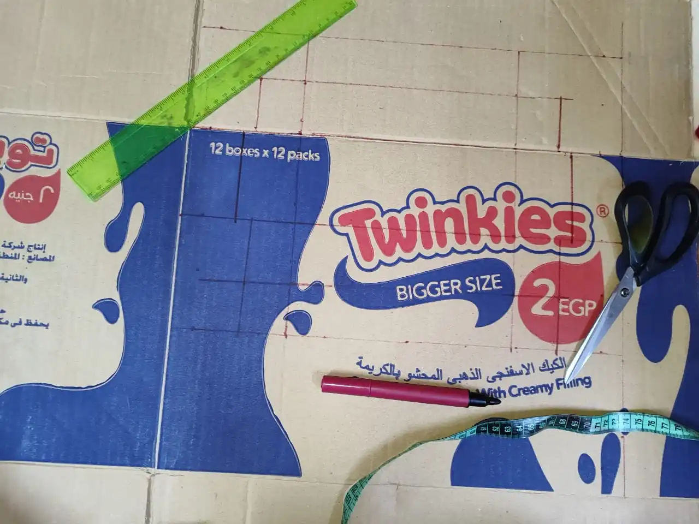
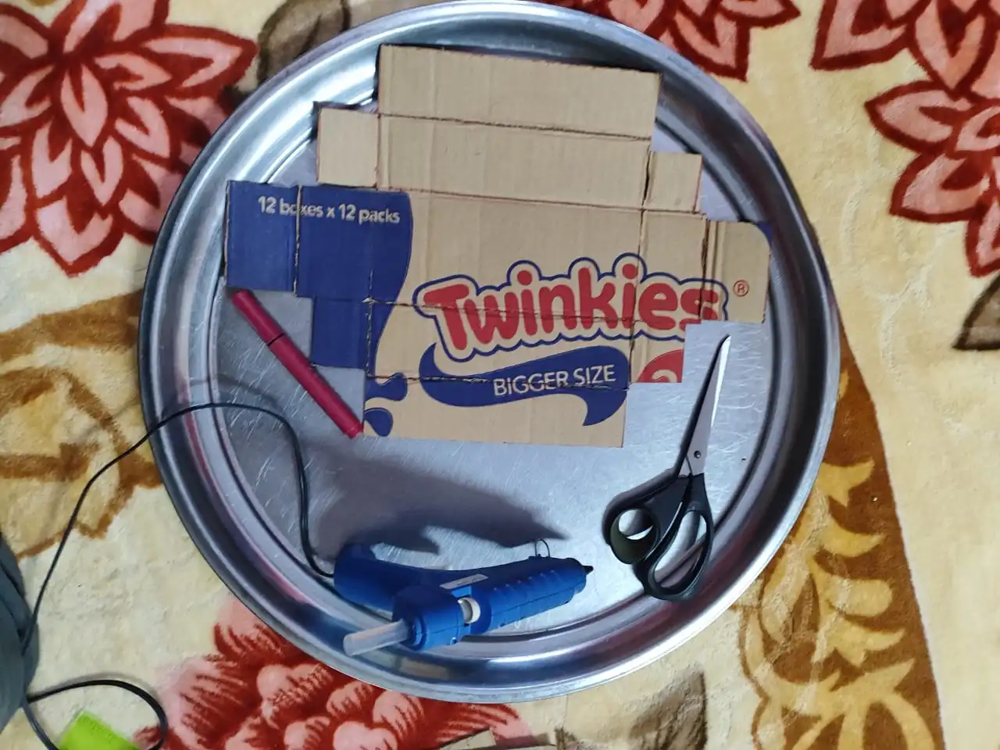
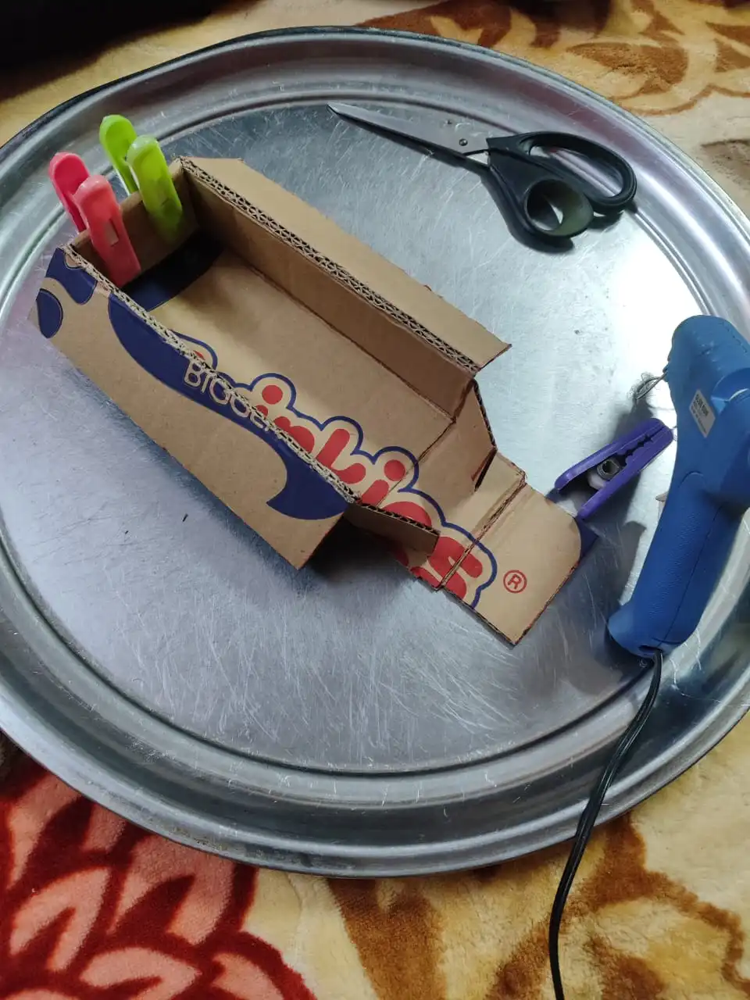
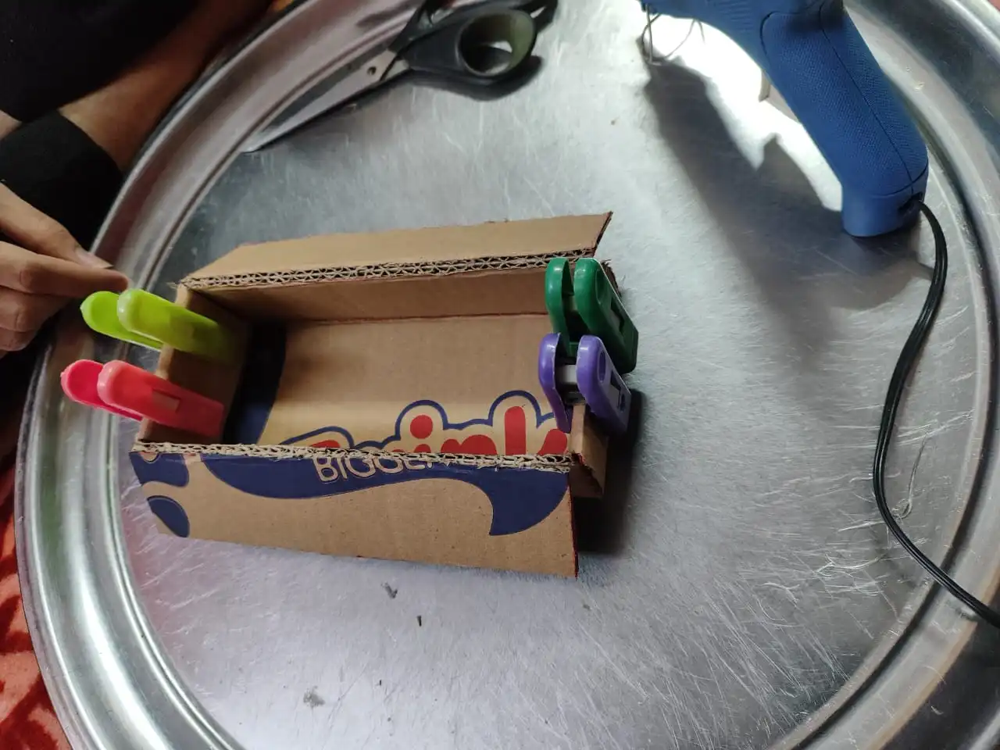

# DIY Standalone 3D Scanner - Raspberry Pi Edition

A DIY 3D scanner built using a Raspberry Pi 3 Model B, USB camera, and stepper motor. This project creates 3D models of physical objects using the "Shape from Silhouettes" algorithm with computer vision.

## Project Overview

This scanner captures multiple images of an object rotating on a turntable and reconstructs a 3D model that can be exported as an STL file for 3D printing. The system uses:

- **Raspberry Pi 3 Model B** - Main processing unit
- **USB Camera** - Image capture
- **NEMA 17 Stepper Motor** - Turntable rotation
- **A4988 Stepper Driver** - Motor control
- **Blue background** - For silhouette extraction

The scanner processes everything locally and outputs standard STL files ready for 3D printing.

---

## Part 1: Building the Scanner Body

### Materials Needed

- Cardboard (sturdy, corrugated recommended)
- Box net generator code (in `box_net_generator` folder)
- Ruler and marker
- Box cutter or scissors
- Hot glue gun or strong adhesive

### Step 1: Generate the Box Net

We used the `box_net_generator.py` script to visualize the cutting pattern for our cardboard housing.

**Dimensions:**
```python
x = 200  # width in mm
y = 80   # height in mm
z = 50   # depth in mm
```

Run the generator:
```bash
cd box_net_generator
python box_net_generator.py
```

**Generated Net Pattern:**



*The pattern shows the unfolded box with doubled side panels for extra rigidity. Orange outline indicates total dimensions: 400mm × 280mm*

### Step 2 & 3: Draw the Pattern and Cut/Score

 

*Left: Using the dimensions from the generated net, carefully draw the pattern on old cardboard with a ruler and marker*  
*Right: Use a sharp box cutter or scissors to cut along the outer edges, then half-cut (score) the fold lines - cut partway through but not all the way to the other side*

### Step 4 & 5: Glue First Side and Second Side

 

*Left: Apply hot glue to the tabs on one side and press firmly to secure. Hold for 30 seconds until the glue sets*  
*Right: Repeat the gluing process on the opposite side to complete the box assembly*

### Step 6: Final Box


*The completed housing ready for electronic components installation*

---

## Next Steps

In Part 2, we will cover:
- Electronics wiring and connections
- Raspberry Pi setup and software installation
- Camera mounting and calibration
- Turntable assembly
- Testing and calibration

---

## Repository Structure
```
├── box_net_generator/
│   └── box_net_generator.py
├── images/
│   ├── box_net_pattern.webp
│   ├── step_drawing.webp
│   ├── step_cutting.webp
│   ├── step_glue_side1.webp
│   ├── step_glue_side2.webp
│   └── final_box.webp
├── software/
│   └── (to be added in Part 2)
└── README.md
```

---

## License

This project is based on the original work by Jun Takeda, adapted for Raspberry Pi.

## Acknowledgments

- Original project: [DIY Standalone 3D Scanner](https://www.instructables.com/DIY-Standalone-3D-Scanner/) by Jun Takeda
- Algorithm: Shape from Silhouettes with Marching Cubes mesh generation
